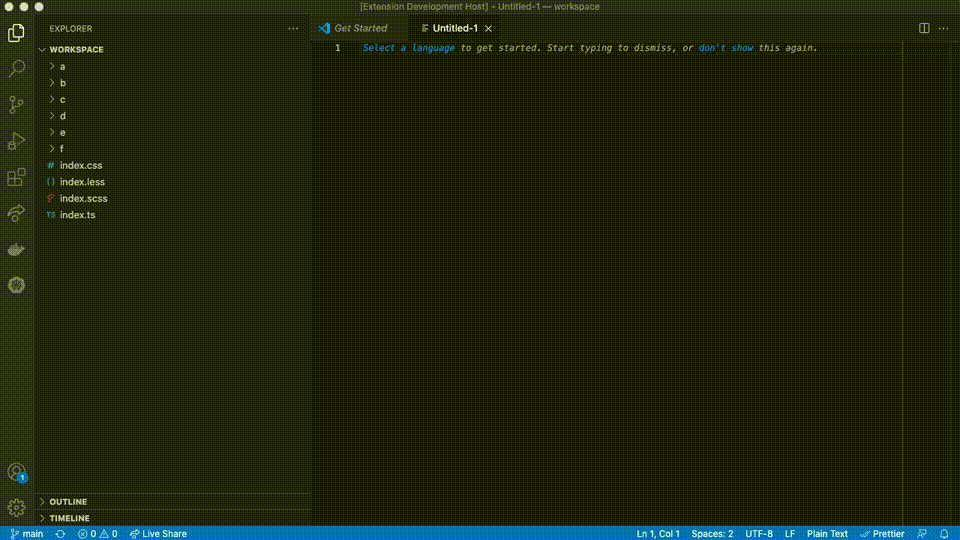

# VS Code Circular Dependencies Finder
Find circular dependencies in your project. Supports the following filetypes: `.js`, `.jsx`, `.ts`, `.tsx`, `.css`, `.scss`, `.less`.

## How to use
1. Open the command palette (View -> Command Palette, or <kbd>cmd</kbd> + <kbd>shift</kbd> + <kbd>p</kbd> on macOS, <kbd>ctrl</kbd> + <kbd>shift</kbd> + <kbd>p</kbd> on Windows).
2. Type `circular dependencies` and select the command you wish to run.

## Known Issues
- Doesn't support [tsconfig.paths](https://www.typescriptlang.org/tsconfig). 
- Doesn't detect `.ts` imports from `.js` files.

**Enjoy!**
